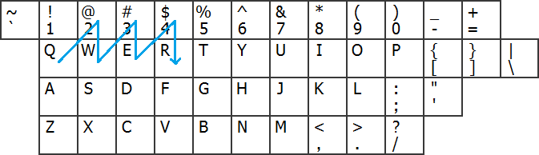
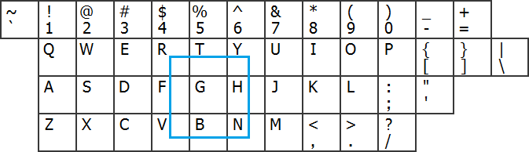
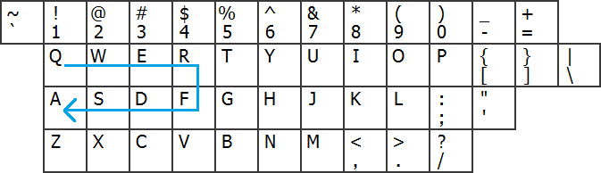
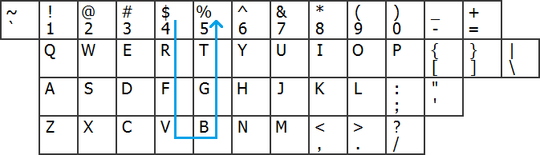
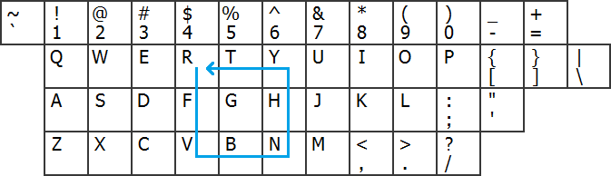
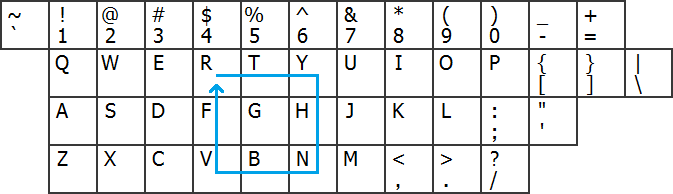
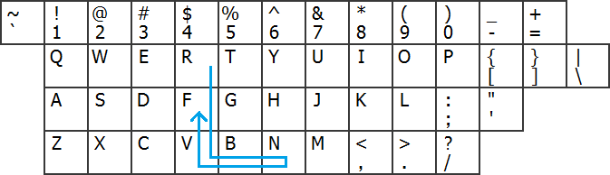
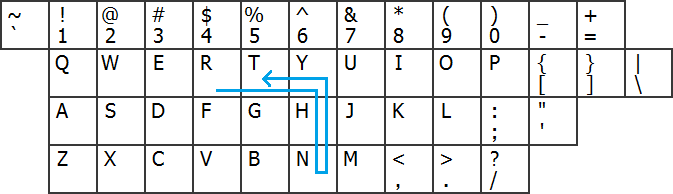
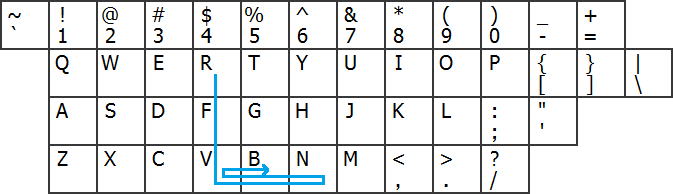

# kwprocessor

Advanced keyboard-walk generator with configureable basechars, keymap and routes

## License

**kwprocessor** is licensed under the MIT license. Refer to [doc/license.txt](doc/license.txt) for more information. 

## Background

A few weeks back I was in need of a keyboard-walk generator but none of the options available did satisfy my needs.

The main issue starts with the definition of "what is a keyboard-walk". So far it seems everybody has their own definition which in turn leads to incompatibilities when it comes to password cracking.

Human generated passwords follow their creators logic, whatever they may be. Those logics may be compatible or incompatible with your rules of password creation, but even if your rules are correct, that's not how you crack a password. Password cracking isn't won by academic work and their definitions, because the people in charge don't follow academic rules. To be efficient, you have to be the user, with all their faults.

So why is this important for a keyboard-walk generator and why do I point it out here? It's simply because it was the path I went when I decided to write my own keyboard-walk generator and why not to use any existing one. I thought it's important to understand the motivation of people using keyboard-walks and why do they use them in the first place. The answer I came up with was: It's a trade-off. This trade-off is the important factor I have to focus on if I want my generator to be any useful, otherwise it's just a waste of time.

People usually aren't dumb, especially those who want to protect something. While not being dumb, they are still humans. I wouldn't call all humans lazy, but humans tend to find energy-efficient solutions to their problems, especially if it's part of their daily routine. So the trade-off I'm talking about here is a solution that sits between low and high security. Why is that?

High security, like an appropriate password database or some kind of extra hardware, means additional management overhead. That's hindering peoples workflow and in turn makes it an instant no-go or at least over time no-go for the most people. Only some people with a high security awareness are willing to go through that. Low security, like just "password" for the password, is equally repulsive since they know it's being cracked instantly, especially when we talk about people who have to protect something.

Another (more technical) aspect could be a password policy. Even if the (password) security community tells us for some time that password policies are bad for password security, administrators still enforce password policies. Anyway, what I'm trying to say here is: If there's a password policy, especially a very strict one, the user somehow needs to deal with it. It gets even worse if there's an additional enforced password expiry. Sooner or later their password pattern are no longer useable which will annoy the user so much that he accepts a lower security just to met the criterias of the policy.

This trade-off is some weird kind of "Medium" security. From a digital perspective there's no such thing, especially not in the digital world we operate in. We, who work with password cracking on a daily basis, know that. But remember, to win the game of password cracking, we have to think like the user, with all their faults. For them such a thing as "Medium" security exist, because it exists in an traditional, non-digital world.

## Configuration

Sometimes people come to the conclusion that a keyboard-walk is such a "Medium" security solution. A password like "q2w3e4r" comes to the rescue, it looks random for those who do not crack passwords and random is good, isn't it. With some shift-pressing pattern here and there it can even match some harder password policies. Anyway, this gives a good start for how to use my keyboard-walk generator (calling it KWP from now) and how to configure it. The password "q2w3e4r" is a sawtooth pattern. If you follow it on your keyboard, it looks like this:



There are a few important parts here.

* It's a pattern. A keyboard-walk generator should generate such pattern automatically. Pattern are the reason users are using keyboard-walks, because they are easy to remember. They are only easy to remember if they are easy.
* It's a pattern that explicitly works with adjacent tiles. A keyboard-walk generator should only generate those. Any required jumping to create certain pattern should be done in a post-process.

The above pattern can get assigned a name, it's a known pattern, we can "recognize" it. But it shouldn't even be part of the configuration. However, such a known pattern has another attribute which we will heavily make use of in the configuration. It's important to understand this concept in order to understand how to configure the KWP:

### The concept of geographic direction changes

For an easy pattern the total number of geographic direction changes are limited. That's why I've decided that the limitation of the direction changes is the best way to control the amount of generated password candidates. The type of the pattern is not important, because of what I tried to explain in the introduction. Such pattern can be arbitrary. Just because they make no sense to us, they can make sense to the user. Remember, we need to think like the user, with their faults. That's why the type of the pattern can not be part of the configuration.

I'll explain the configuration of direction changes later in the "routes" section. But before we go there, there's another important thing to mention: 

### The base-character

A password, even if it's a pattern, has to start somewhere. Most of the known keyboard-walks start with 1 or q, that's well known. But again, the user isn't a researcher. If the user doesn't know most keyboard-walks starts with 1 or q, then there's some chance his password will not start with 1 or q.



In this image the keyboard walk is a square, but I didn't set any starting point by purpose. The password could be "rtyhnbvf", we don't know. It could be "vbnhytrf", too. The pattern also sits at the center of the keyboard, not on the start. Funny side node: Both passwords actually can be found on the LI dump.

What I'm trying to show here is the concept of the base-character. The base-character is independent from the pattern type. That's why you have to select the order of the base characters in the configuration. The generator will then run all the pattern-types that match your pattern configuration on all the base-characters you've configured, in that order.

Let's go back to the geographic direction changes configuration:

Because of the design of the keyboard, there's only 9 possible geographic direction changes:

* SOUTH-WEST
* SOUTH
* SOUTH-EAST
* WEST
* STAY
* EAST
* NORTH-WEST
* NORTH
* NORTH-EAST

In case you're wondering: The ordering matches your numpad ordering. 

### The keymap layout

There's many different keymap layouts and since this can lead to completely different candidates, the KWP needs to know which layout you want to use. For example, the English and the German keyboard layout differ in many aspects. For instance, the position of the "x" is switched with the "y". 

That means for the "313" configuration the KWP will create a candidate "1qazxsw2" if you select an English layout and a candidate "1qayxsw2" if you select a German layout. I've added those both layouts and I hope people will contribute to this with their own language specific layouts, therefore I tried to make the configuration of the keymap layout file as easy as possible. 

Here's how it looks like for the English one:

```
`1234567890-=
 qwertyuiop[]\
 asdfghjkl;'
 zxcvbnm,./
~!@#$%^&*()_+
 QWERTYUIOP{}|
 ASDFGHJKL:"
 ZXCVBNM<>?


```

Here's the rules:

* Each keymap has exactly 12 lines (which is 3 times 4 lines):
* The first 4 lines represent the characters 1:1 as they are on the keyboard without pressing shift or alt-gr.
* The next 4 lines, same as above, but by pressing shift.
* The next 4 lines, same as above, but by pressing alt-gr (important for non-English keyboards).
* Non-printable characters like tab or shift are white-spaced
* Current version does not yet support 8-bit characters, please white-space them

This leads us to another of KWP's features. It can handle shift and alt-gr as well. For example, the route "313" will also create the candidate: "qwerFDSA". However, you have to explicitly enable this feature from the command line, it's disabled by default. Please see the --help menu how to do that.

Note that the candidate "qwerFDsA" is not produced by the route "313". Instead, this requires the route "31111". This is because internally the KWP has a total of 27 geographic direction changes. That is the above mentioned 9, plus 9 for the same buttons but with shift and the final 9 for the keys combined with alt-gr.

Finally, you have to configure the base-character line. This is a file with just one line, like this:

```
!"#$%&'()*+,-./0123456789:;<=>?@ABCDEFGHIJKLMNOPQRSTUVWXYZ[\]^_`abcdefghijklmnopqrstuvwxyz{|}~
```

Some rules:

* You're not forced to use all 94 7-bit characters.
* Listed characters that are not also listed in the selected keymap will be ignored silently.
* Ordering of the configuration is unchanged.

## Routes

The most important thing. If you get this, you win! A "route" is simply the word that I've chosen to represent a configuration for the pattern.

The configuration for both of the following pattern, the "route", is: 313

* START (base-character = q) + 3 * EAST + 1 * SOUTH -> 3 * WEST = qwerfdsa



* START (base-character = 4) + 3 * SOUTH + 1 * EAST + 3 * NORTH = 4rfvbgt5



* Note: also "1234rewq" and "1qazxsw2" (and others) would fit the route 313 and are examples of using a different starting point. You'll see a full output in examples section below.

In detail, the route "313" means, the KWP will brute-force all pattern:

* From starting base character
* 3 times all of the above geographic direction
* 1 times all of the above geographic direction, but not the previous one
* 3 times all of the above geographic direction, but not the previous one

This concept has two more very important things to mention:

* It guarantee's that the KWP can never produce a duplicate password candidate
* The length of the passwords candidate is 1 + cross total. In our case 1 + 3 + 1 + 3 = 8

Another thing to mention is that invalid candidates get rejected. An invalid candidate is when a pattern goes out of boundaries. For example, if the base-character is 1, there can be no pattern that start heading for NORTH-WEST, NORTH, NORTH-EAST or SOUTH-WEST because there's no such key on the keyboard.

Of course, there can be many routes in a route file, how else would you be able to create different pattern than such a rectangle.

## Example

Let's do some easy example. We want to create the square password "rtyhnbvf" as straight as possible, as we have seen in one of the image above. 

Note that we can not force the KWP to generate a square, with the reasons stated in the background section in the beginning of this document, but we can configure it as close as possible so that you can see what's going on here. That means, we can use a very specific route that is able to generate squares, but in general this route we define will not be limited to only generate squares but it will generate all patterns that follow that specific sequence of geographic direction changes of the defined lengths.

The first configuration item the KWP wants from you is a list of base characters. This is usually a list of characters, but we can also use a single character if we want to. 

So we create a file "basechar.txt" with the content "r", that's it.

```
r
```

The second configuration item the generator wants from you is the keymap. We could take the preconfigured english keymap, it's simple enough, but I want to show you that it's pretty easy to generate your own keymap. So lets leave everything of no importance and create a file "keymap.txt" with the following content:

```
rty
fgh
vbn
```

The only important part here is that you make this file to have exactly 12 lines. For the purpose of this example I've truncated it.

The third and last configuration item the generator wants from you is the route. Let's think for a second how such a route needs to look like. Even if you believe such a thing is not required for regular use because KWP comes with a set of predefined routes, it may help you if you want to pick a special one yourself. 

* We'll start with the "r" because it's the only existing base-character. 
* We want to have "ty" next. That make two steps, so all we need to configure is "2". 
* We want to have "hn" next. That make two steps, so all we need to configure is "2". 
* We want to have "bv" next. That make two steps, so all we need to configure is "2".
* We want to have "f" next. That makes one step, so all we need to configure is "1".
* The final content in our "route.txt" is: 2221

```
2221
```

Now all the configuration is taken care of. Here's what this will generate:

```
$ ./kwp basechar.txt keymap.txt route.txt | grep rtyhnbvf
rtyhnbvf
```

As you can see I've filtered this to print out only the pattern we were looking for. That's just a proof that it actually generated it. Here's the full output:

```
$ ./kwp basechar.txt keymap.txt route.txt | sort
rfvbnbvb
rfvbnbvf
rfvbnhyh
rfvbnhyt
rfvfrfvb
rfvfrfvf
rfvfrtyh
rfvfrtyt
rtyhnbvb
rtyhnbvf
rtyhnhyh
rtyhnhyt
rtytrfvb
rtytrfvf
rtytrtyh
rtytrtyt
```

You may notice there's no use of the "g" character, even if it's an adjacent tile character and it's part of the keymap. The reason for that is that diagonal tiles are disabled by default. Of course you can enable them, see --help for details. 

But more important here is how the pattern looks like. I made pictures for some of them to get a better feeling for it. The following keyboard walks show some nice patterns:

* Rectangle east : rfvbnhyt



* Rectangle south : rtyhnbvf



* Rectangle south and north : rfvbnbvf



* Rectangle east and west : rtyhnhyt



But there are even those pattern who aren't perfectly aligned like this one:

* Rectangle east and west : rfvbnbvb



However, they are still good candidates and they match up what we were initially looking for. We have the perfect ones and those that are not perfect, which makes them human.
